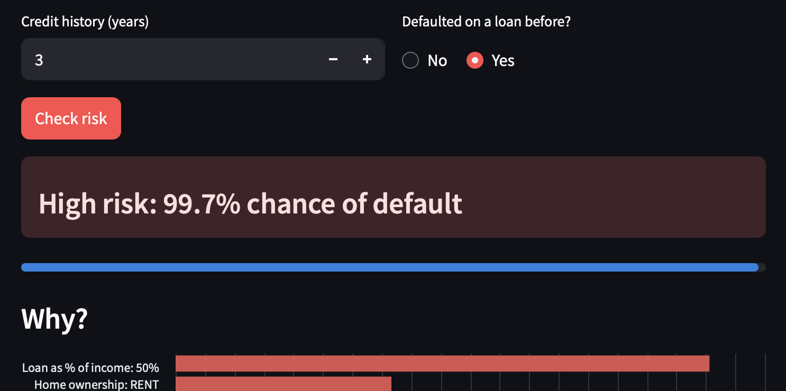
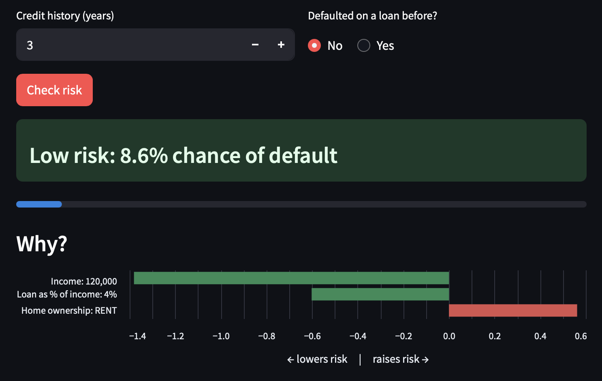
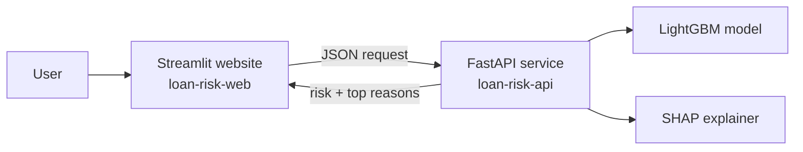

# 🏦 Explainable Loan Risk Checker

**Predicts the risk that a loan applicant will default, and explains *why*, using LightGBM and SHAP. Deployed as a live web app on Microsoft Azure.**

### 🔗 [**Try the live demo**](https://loan-risk-web.salmonocean-eff18f20.francecentral.azurecontainerapps.io)

> ⏳ The app sleeps when idle to save cloud costs, so the first visit may take up to a minute to load.

API documentation: [loan-risk-api/docs](https://loan-risk-api.salmonocean-eff18f20.francecentral.azurecontainerapps.io/docs)

---

## Screenshots

| High-risk applicant | Low-risk applicant |
|---|---|
|  |  |

Red bars show factors that **raised** the risk; green bars show factors that **lowered** it.

---

## What it does

A user enters an applicant's details (age, income, loan amount, employment length, home ownership, loan purpose, credit history and previous defaults). The app returns:

1. **A risk label** (High / Low) and the estimated probability of default.
2. **The top 3 reasons** behind the decision, calculated with SHAP and shown as a colour-coded chart.

Explainability matters here: lenders need to justify automated decisions to customers and regulators, not just make them.

---

## How it works



- **Frontend:** a Streamlit website that sends the form data to the API and displays the result.
- **Backend:** a FastAPI service that loads the trained model, makes the prediction and calculates SHAP explanations.
- **Deployment:** both run from one Docker image as two separate apps on **Azure Container Apps**. An environment variable decides whether a container starts the website or the API.

---

## Results

Trained on ~32,000 loan records, evaluated on a stratified 20% hold-out set.

| Model | ROC-AUC | Recall (defaults) | Precision (defaults) |
|---|---|---|---|
| Logistic Regression | 0.807 | 0.703 | 0.442 |
| **LightGBM (selected)** | **0.911** | **0.761** | **0.657** |

LightGBM catches about 3 in 4 applicants who went on to default. Recall was prioritised because, for a lender, missing a default costs more than double-checking a safe applicant.

---

## Key decisions

- **Avoiding data leakage.** The dataset includes `loan_grade` and `loan_int_rate`, but these are set by the lender's *own* risk assessment. Using them would let the model copy the bank's answer rather than learn risk, and a real applicant wouldn't know them when filling in a form. Both were excluded.
- **Readable SHAP explanations.** One-hot encoding splits features like home ownership into several columns (RENT, OWN, MORTGAGE…). The API adds their SHAP values back together, so users see "Home ownership" rather than confusing internal column names.
- **Reproducible environment.** Library versions are pinned in `requirements.txt` to match the training environment, because a saved model can fail to load under different library versions.
- **Cross-platform builds.** The image is built on an Apple Silicon Mac (arm64) but targets Azure's servers (amd64), using `docker buildx --platform linux/amd64`.
- **One image, two services.** The API and website share a single Docker image; a `SERVICE` environment variable chooses what starts. This keeps builds simple and guarantees both parts use identical dependencies.

---

## Limitations

- **Tree models don't extrapolate.** LightGBM can't learn beyond the range of its training data, so predictions for extreme inputs (e.g. very high incomes) are unreliable. A future improvement is to warn users when inputs fall outside the training range.
- **Probabilities aren't calibrated.** The model uses class weighting to handle the imbalance between defaults and repayments, which shifts predicted probabilities upward. The ranking of applicants is reliable (hence the strong ROC-AUC), but the exact percentages shouldn't be read as true default rates without calibration.
- **Public dataset.** The data comes from a public Kaggle dataset, not a real lender, so the model is a demonstration and not suitable for real lending decisions.

---

## Tech stack

**Machine learning:** Python, pandas, scikit-learn, LightGBM, SHAP  
**Backend:** FastAPI, Uvicorn  
**Frontend:** Streamlit, Altair  
**Deployment:** Docker, Docker Compose, Docker Hub, Azure Container Apps  
**Version control:** Git, GitHub

---

## Run it locally

You need [Docker Desktop](https://www.docker.com/products/docker-desktop/) installed. The trained model is included in the repository, so no training is needed to run the app.

```bash
git clone https://github.com/Garyroyston23/loan-risk-app.git
cd loan-risk-app
docker compose up --build
```

Then open **http://localhost:8501** for the website, or **http://localhost:8000/docs** for the API.

### Retrain the model (optional)

1. Download `credit_risk_dataset.csv` from [Kaggle](https://www.kaggle.com/datasets/laotse/credit-risk-dataset) and place it in a `data/` folder.
2. Install the dependencies with `pip install -r requirements.txt`.
3. Run `python train.py`. The new model is saved to `model/model.joblib`.

---

## Project structure

```
├── train.py              # Cleans data, trains and compares models, saves the best one
├── api.py                # FastAPI service: predictions + SHAP explanations
├── app.py                # Streamlit website
├── model/
│   ├── model.joblib      # Trained pipeline (preprocessing + LightGBM)
│   └── metrics.json      # Evaluation scores for each model
├── Dockerfile            # Container recipe
├── docker-compose.yml    # Runs the API and website together locally
└── requirements.txt      # Pinned library versions
```

---

## Roadmap

- [ ] **CI/CD** with GitHub Actions: automatically test, build and deploy on every push
- [ ] **Automated tests** for the API and model
- [ ] **Monitoring:** log predictions and detect data drift
- [ ] **Input range warnings** for values outside the training data

---

## Author

**Gary Royston** · MSc in Artificial Intelligence, National College of Ireland  
[GitHub](https://github.com/Garyroyston23) · [LinkedIn](ADD_YOUR_LINKEDIN_URL_HERE)
